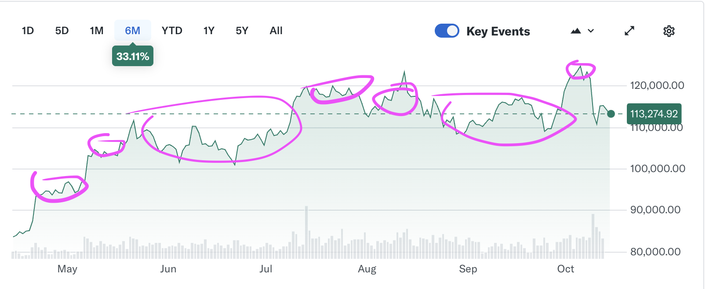

# Algorithmic Trading AI with Python

## Target Market Pattern
 - Volatile Market
 - Lots of news events 
 - High volume



## Libraries
 - Yfinance (datasource)
 - Pytorch Transformer 
 - Gemma embedding 300m GOOGLE 
 - matplotlib
 - Pandas
 - Numpy
 - Scikit-learn

## Target Symbol
 - BTC-USD (Bitcoin to US Dollar)
 - AAPL (Apple Inc.)
 - TSLA (Tesla Inc.)
 - GC=F (Gold Futures)

## Inputs and outputs

### Input data
 - Historical price data 
 - News headlines sentiment will be derived
 - Foreign policy events

### Outputs
 - Sell/Hold/Buy signals

## Model
 - Gemma Embedding (300m parameters)
 - Pytorch Transformer
 - Classification Layer ([3] output)

## Training
 - Supervised learning
 - Reinforcement learning

### Input Data Format 

Sorted by date, descending.

```
Prices: list of prices
Headline: list of news headlines
```

```
Prices: 10.0,11.0,14.0,8.0,10.0,5.0
Headline: Sector Update: Financial Stocks Rise Tuesday Afternoon

Prices: 10.0,11.0,14.0,8.0,10.0,5.0
Headline: Sector Update: Financial Stocks Rise Tuesday Afternoon

Prices: 10.0,11.0,14.0,8.0,10.0,5.0
Headline: Sector Update: Financial Stocks Rise Tuesday Afternoon
```
### Ouptput Data Format
Sell/Hold/Buy signals
[0,   0,   0 ]

Sell = [1, 0, 0]
Hold = [0, 1, 0]
Buy  = [0, 0, 1]

### Limit Triggers Indications
- Average up and down cycles
- 1% limit triggers 100 gain 1 dollar 101
- time window is 5 minutes
